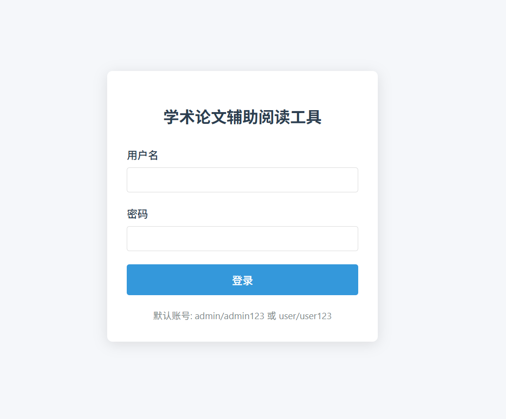
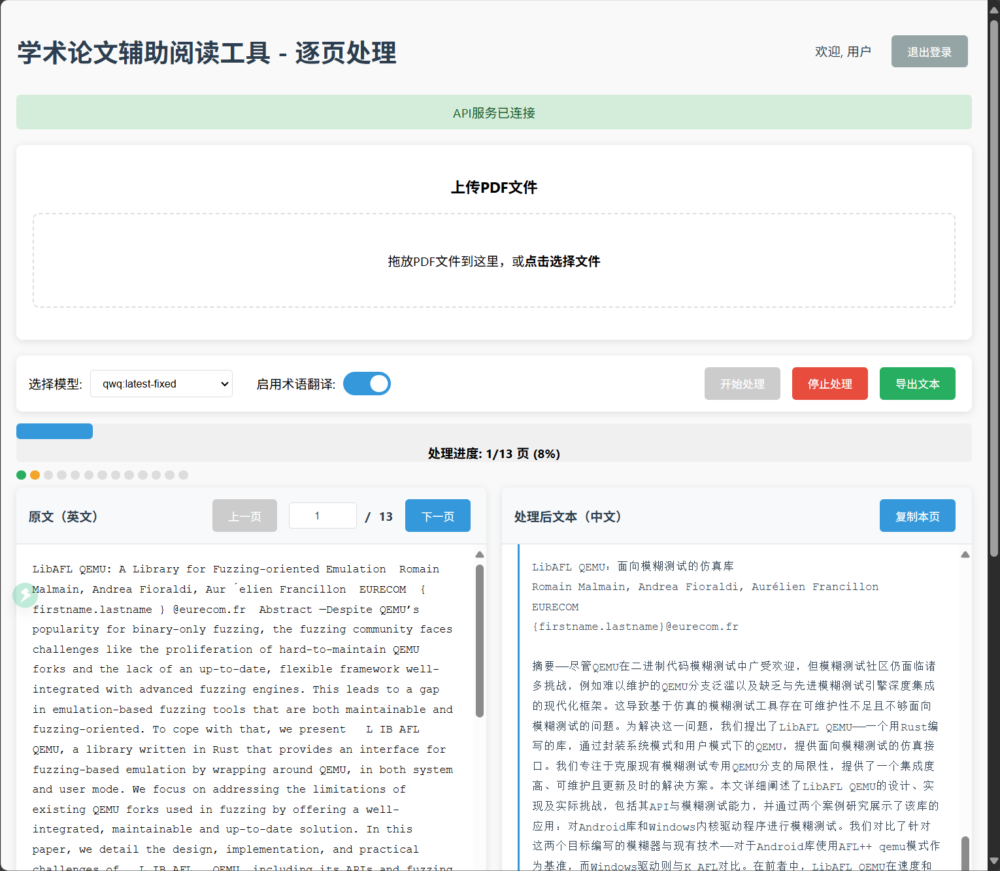

# LLM Paper Web Reader

这是一个非常轻量的可以部署到自己服务器上的网页，支持登录，并且拖入PDF并逐页解析成可以被理解的中文内容，并且可以导出原文和译文，方便阅读论文，功能也非常简单。

默认启动在 8080 端口，qwq:latest-fixed 模型。





## 使用环境

Linux 系统，安装了 Ollama，并且 Ollama 的模型已经下载好，服务也启动了。 

## 部署方法

### 前置步骤

先更改 `.env.example` 中的变量信息，就可以了。具体怎么改都写在注释里了。

可以选择本地或者 Docker 部署。

(如果你没有api，只有dify的api，可以尝试先运行一下文件夹translate_dify_to_ollama/test_flask.py，做一个dify到ollama的逆向转发。这是一个很小众的需求，这里就不展开介绍了)

### 1 本地部署

```bash
./start_app.sh
```

### 2 Docker 部署

前提是装好了 Docker。

```bash
./start_docker.sh
```

改动后重新部署：
```bash
./restart_docker.sh
```

> 以后如果要开发其他的应用也可以按照这个流程走。